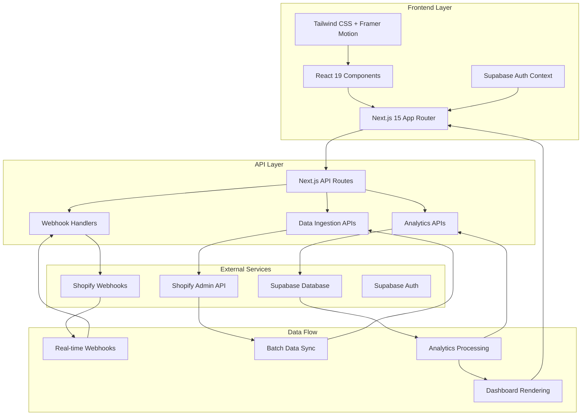
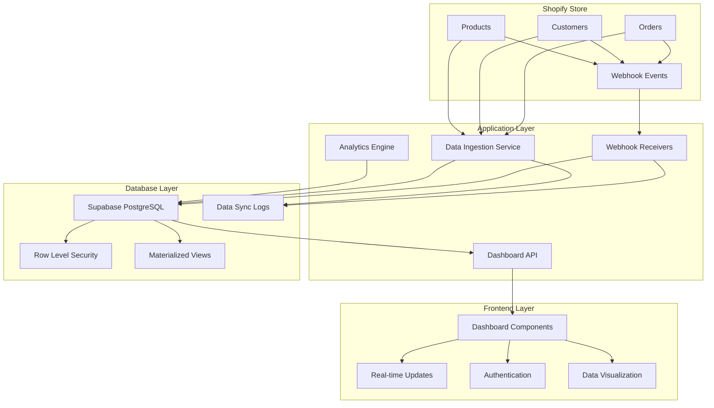
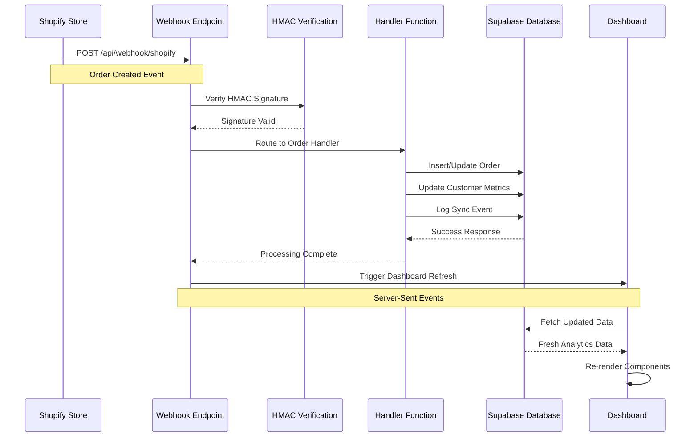
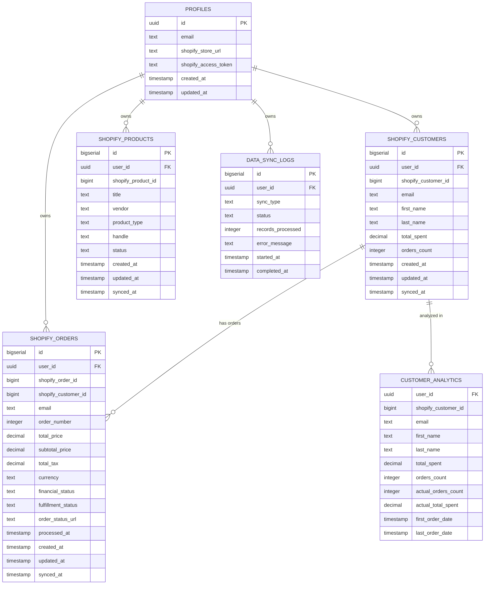

# Shopify Insights Dashboard

A powerful AI-driven analytics platform that transforms your Shopify store data into actionable revenue insights. Built with Next.js 15, Supabase, and modern web technologies.

## 🚀 Features

- **Real-time Analytics**: Live KPI tracking with revenue, orders, and customer metrics
- **Interactive Dashboards**: Beautiful charts and visualizations powered by Recharts
- **Customer Insights**: Top customer analysis with spending patterns and behavior tracking
- **Order Analytics**: Time-series analysis of orders and revenue trends
- **Data Ingestion**: Automated Shopify data synchronization with Supabase
- **Authentication**: Secure user management with Supabase Auth
- **Responsive Design**: Modern UI with Tailwind CSS and Framer Motion animations

## 🛠️ Tech Stack

- **Frontend**: Next.js 15, React 19, TypeScript
- **Styling**: Tailwind CSS 4, Framer Motion
- **Backend**: Next.js API Routes, Supabase
- **Database**: PostgreSQL (via Supabase)
- **Charts**: Recharts
- **Authentication**: Supabase Auth
- **Deployment**: Vercel

## 📋 Prerequisites

- Node.js 18+ 
- npm, yarn, pnpm, or bun
- Supabase account
- Shopify store with Admin API access

## 🚀 Getting Started

### 1. Clone the Repository

```bash
git clone <repository-url>
cd shopify-insights
```

### 2. Install Dependencies

```bash
npm install
# or
yarn install
# or
pnpm install
# or
bun install
```

### 3. Environment Setup

Create a `.env.local` file in the root directory:

```env
# Supabase Configuration
NEXT_PUBLIC_SUPABASE_URL=your_supabase_url
NEXT_PUBLIC_SUPABASE_ANON_KEY=your_supabase_anon_key
SUPABASE_SERVICE_ROLE_KEY=your_supabase_service_role_key

# Shopify Configuration
SHOPIFY_STORE_URL=https://your-store.myshopify.com
SHOPIFY_ACCESS_TOKEN=your_shopify_access_token
```

### 4. Database Setup

1. Go to your Supabase project dashboard
2. Navigate to the SQL Editor
3. Run the SQL script from `supabase-setup.sql` to create the required tables

### 5. Run the Development Server

```bash
npm run dev
# or
yarn dev
# or
pnpm dev
# or
bun dev
```

Open [http://localhost:3000](http://localhost:3000) to view the application.

## 📁 Project Structure

```
shopify-insights/
├── src/
│   ├── app/                    # Next.js App Router
│   │   ├── api/               # API Routes
│   │   ├── auth/              # Authentication pages
│   │   ├── dashboard/         # Main dashboard
│   │   └── page.tsx           # Landing page
│   ├── components/            # React components
│   ├── contexts/              # React contexts
│   ├── lib/                   # Utility libraries
│   └── types/                 # TypeScript type definitions
├── public/                    # Static assets
├── supabase-setup.sql         # Database schema
└── vercel.json               # Vercel deployment config
```

## 🛣️ API Routes Documentation

### Authentication & System Routes

#### `/api/test` - `GET`
- **Purpose**: Basic Supabase connection test
- **Response**: Connection status and error details
- **Use Case**: Health check and debugging

#### `/api/db-test` - `GET`
- **Purpose**: Advanced database connectivity test
- **Response**: Database schema information and table listings
- **Use Case**: Verify database setup and permissions

#### `/api/env-check` - `GET`
- **Purpose**: Environment variables validation
- **Response**: Status of required environment variables
- **Use Case**: Debug configuration issues

### Shopify Integration Routes

#### `/api/shopify-test` - `GET`
- **Purpose**: Test Shopify API connection and data fetching
- **Response**: Shop information and sample data from customers, products, and orders
- **Use Case**: Verify Shopify API credentials and connectivity

#### `/api/customers` - `GET`
- **Purpose**: Fetch and search customer data
- **Query Parameters**:
  - `search` (optional): Search customers by name or email
  - `demo` (optional): Return demo data instead of real data
- **Response**: Customer list with enhanced display names and metadata
- **Use Case**: Customer management and analysis

### Data Ingestion Routes

#### `/api/ingestion/start` - `POST`
- **Purpose**: Start data synchronization from Shopify to Supabase
- **Response**: Ingestion status and counts of synced records
- **Use Case**: Initial data setup and periodic synchronization
- **Timeout**: 60 seconds (configured in vercel.json)

### Webhook Routes (Real-time Data Sync)

#### `/api/webhooks/orders/create` - `POST`
- **Purpose**: Handle new order webhooks from Shopify
- **Handler**: `handleNewOrder`
- **Trigger**: When a new order is created in Shopify
- **Actions**:
  - Insert new order into `shopify_orders` table
  - Update customer order count and total spent
  - Log webhook event in `data_sync_logs`
  - Trigger real-time dashboard updates
- **Webhook Topic**: `orders/create`
- **Authentication**: Shopify webhook verification

#### `/api/webhooks/orders/updated` - `POST`
- **Purpose**: Handle order update webhooks from Shopify
- **Handler**: `handleOrderUpdate`
- **Trigger**: When an existing order is modified
- **Actions**:
  - Update order data in `shopify_orders` table
  - Recalculate customer metrics if order value changed
  - Log update event for audit trail
  - Refresh affected analytics
- **Webhook Topic**: `orders/updated`
- **Authentication**: Shopify webhook verification

#### `/api/webhooks/orders/cancelled` - `POST`
- **Purpose**: Handle order cancellation webhooks from Shopify
- **Handler**: `handleOrderCancellation`
- **Trigger**: When an order is cancelled
- **Actions**:
  - Update order status to cancelled
  - Adjust customer metrics (remove from total spent)
  - Update financial status tracking
  - Log cancellation event
- **Webhook Topic**: `orders/cancelled`
- **Authentication**: Shopify webhook verification

#### `/api/webhooks/customers/create` - `POST`
- **Purpose**: Handle new customer webhooks from Shopify
- **Handler**: `handleNewCustomer`
- **Trigger**: When a new customer registers
- **Actions**:
  - Insert new customer into `shopify_customers` table
  - Initialize customer metrics (total_spent: 0, orders_count: 0)
  - Set up customer tracking
  - Log customer creation event
- **Webhook Topic**: `customers/create`
- **Authentication**: Shopify webhook verification

### Analytics & Insights Routes

#### `/api/insights/kpis` - `GET`
- **Purpose**: Fetch key performance indicators
- **Response**: Total revenue, orders, customers, and average order value
- **Data Sources**: Supabase (cached) or Shopify API (fallback)
- **Use Case**: Dashboard KPI cards

#### `/api/insights/orders-over-time` - `GET`
- **Purpose**: Get time-series data for orders and revenue
- **Query Parameters**:
  - `startDate` (optional): Start date for the range (default: 30 days ago)
  - `endDate` (optional): End date for the range (default: now)
- **Response**: Daily aggregated order counts and revenue
- **Use Case**: Order trends charts

#### `/api/insights/top-customers` - `GET`
- **Purpose**: Get top customers by total spending
- **Response**: Top 5 customers with spending and order data
- **Data Sources**: Supabase or demo data fallback
- **Use Case**: Customer leaderboard

#### `/api/insights/top-customers/mock` - `GET`
- **Purpose**: Mock data endpoint for top customers
- **Response**: Sample customer data for testing
- **Use Case**: Development and demonstration

### Alternative Route Implementations

#### `/api/insights/kpis/route-fixed.ts`
- **Purpose**: Alternative KPI implementation
- **Status**: Backup/experimental version

#### `/api/insights/orders-over-time/route-new.ts`
- **Purpose**: Alternative orders-over-time implementation
- **Status**: Backup/experimental version

## 🎨 Frontend Routes

### Public Routes

#### `/` - Landing Page
- **Purpose**: Marketing page with feature highlights
- **Features**: Animated hero section, feature cards, call-to-action buttons
- **Navigation**: Links to signup and signin pages

### Authentication Routes

#### `/auth/signin` - Sign In Page
- **Purpose**: User authentication
- **Features**: Email/password form, error handling, responsive design
- **Redirect**: Successful login → `/dashboard`

#### `/auth/signup` - Sign Up Page
- **Purpose**: User registration
- **Features**: Full name, email, password, confirmation fields
- **Validation**: Password strength, email format, password matching
- **Redirect**: Successful registration → `/dashboard`

### Protected Routes

#### `/dashboard` - Main Dashboard
- **Purpose**: Analytics dashboard with KPIs and charts
- **Features**:
  - KPI cards (Revenue, Orders, Customers, AOV)
  - Interactive charts (Orders over time, Top customers)
  - Customer list with search functionality
  - Tabbed interface for different chart types
- **Authentication**: Required (redirects to signin if not authenticated)

## 🔧 Configuration

### Vercel Deployment

The application is configured for Vercel deployment with:

- **API Timeouts**: 30 seconds for most routes, 60 seconds for data ingestion
- **CORS Headers**: Enabled for all API routes
- **Framework Detection**: Automatic Next.js detection

### Database Schema

Key tables in Supabase:

- `profiles`: User management and Shopify credentials
- `shopify_customers`: Customer data from Shopify
- `shopify_orders`: Order data from Shopify
- `shopify_products`: Product data from Shopify
- `data_sync_logs`: Webhook and sync operation tracking

## 🔗 Shopify Webhook Configuration

### Webhook Setup Process

1. **Access Shopify Admin**:
   - Go to your Shopify store admin panel
   - Navigate to Settings → Notifications
   - Scroll down to "Webhooks" section

2. **Create Webhook Endpoints**:
   ```
   # Order Webhooks
   https://your-app.vercel.app/api/webhooks/orders/create
   https://your-app.vercel.app/api/webhooks/orders/updated
   https://your-app.vercel.app/api/webhooks/orders/cancelled
   
   # Customer Webhooks
   https://your-app.vercel.app/api/webhooks/customers/create
   ```

3. **Configure Webhook Settings**:
   - **Format**: JSON
   - **API Version**: 2024-01 (or latest)
   - **Authentication**: Include HMAC verification

### Webhook Security

The application implements Shopify webhook verification:

```typescript
// Webhook verification process
const hmac = request.headers.get('x-shopify-hmac-sha256')
const body = await request.text()
const hash = crypto
  .createHmac('sha256', process.env.SHOPIFY_WEBHOOK_SECRET!)
  .update(body, 'utf8')
  .digest('base64')

// Verify webhook authenticity
if (hmac !== hash) {
  return NextResponse.json({ error: 'Unauthorized' }, { status: 401 })
}
```

### Webhook Event Handling

Each webhook handler follows this pattern:

1. **Verification**: Validate Shopify HMAC signature
2. **Parsing**: Extract relevant data from webhook payload
3. **Database Update**: Upsert data into appropriate Supabase tables
4. **Metrics Recalculation**: Update customer and order metrics
5. **Logging**: Record webhook event in `data_sync_logs`
6. **Response**: Return 200 status to Shopify

### Webhook Payload Examples

#### Order Created Webhook
```json
{
  "id": 1234567890,
  "order_number": 1001,
  "customer": {
    "id": 987654321,
    "email": "customer@example.com",
    "first_name": "John",
    "last_name": "Doe"
  },
  "total_price": "99.99",
  "currency": "USD",
  "financial_status": "paid",
  "fulfillment_status": "unfulfilled",
  "created_at": "2024-01-15T10:30:00Z",
  "updated_at": "2024-01-15T10:30:00Z"
}
```

#### Customer Created Webhook
```json
{
  "id": 987654321,
  "email": "newcustomer@example.com",
  "first_name": "Jane",
  "last_name": "Smith",
  "created_at": "2024-01-15T09:15:00Z",
  "updated_at": "2024-01-15T09:15:00Z"
}
```

### Webhook Monitoring

The application tracks webhook performance:

- **Success Rate**: Monitor webhook processing success
- **Response Time**: Track webhook processing duration
- **Error Logging**: Detailed error messages in `data_sync_logs`
- **Retry Logic**: Automatic retry for failed webhook processing

### Environment Variables for Webhooks

Add these to your `.env.local`:

```env
# Shopify Webhook Configuration
SHOPIFY_WEBHOOK_SECRET=your_webhook_secret_key
SHOPIFY_API_VERSION=2024-01

# Webhook Processing
WEBHOOK_TIMEOUT=30000
WEBHOOK_RETRY_ATTEMPTS=3
```

## 🚀 Deployment

### Vercel (Recommended)

1. Push your code to GitHub/GitLab/Bitbucket
2. Connect your repository to Vercel
3. Configure environment variables in Vercel dashboard
4. Deploy automatically

See `DEPLOYMENT.md` for detailed deployment instructions.

### Environment Variables Required

- `NEXT_PUBLIC_SUPABASE_URL`
- `NEXT_PUBLIC_SUPABASE_ANON_KEY`
- `SUPABASE_SERVICE_ROLE_KEY`
- `SHOPIFY_STORE_URL`
- `SHOPIFY_ACCESS_TOKEN`

## 🧪 Testing

### API Testing

Test individual endpoints:

```bash
# Test Supabase connection
curl http://localhost:3000/api/test

# Test Shopify connection
curl http://localhost:3000/api/shopify-test

# Test environment variables
curl http://localhost:3000/api/env-check

# Test KPI data
curl http://localhost:3000/api/insights/kpis
```

### Demo Mode

Many endpoints support demo mode for testing without real Shopify data:

```bash
# Get demo customer data
curl "http://localhost:3000/api/customers?demo=true"
```

### Webhook Testing

Test webhook endpoints using webhook simulation tools:

```bash
# Test order creation webhook
curl -X POST http://localhost:3000/api/webhooks/orders/create \
  -H "Content-Type: application/json" \
  -H "x-shopify-hmac-sha256: your_test_hmac" \
  -d '{
    "id": 1234567890,
    "order_number": 1001,
    "total_price": "99.99",
    "currency": "USD",
    "financial_status": "paid",
    "created_at": "2024-01-15T10:30:00Z"
  }'

# Test customer creation webhook
curl -X POST http://localhost:3000/api/webhooks/customers/create \
  -H "Content-Type: application/json" \
  -H "x-shopify-hmac-sha256: your_test_hmac" \
  -d '{
    "id": 987654321,
    "email": "test@example.com",
    "first_name": "Test",
    "last_name": "User",
    "created_at": "2024-01-15T09:15:00Z"
  }'
```

### Webhook Implementation Status

| Webhook Handler | Status | Endpoint | Description |
|----------------|--------|----------|-------------|
| `handleNewOrder` | 🚧 Planned | `/api/webhooks/orders/create` | Process new order events |
| `handleNewCustomer` | 🚧 Planned | `/api/webhooks/customers/create` | Process new customer events |
| `handleOrderCancellation` | 🚧 Planned | `/api/webhooks/orders/cancelled` | Process order cancellations |
| `handleOrderUpdate` | 🚧 Planned | `/api/webhooks/orders/updated` | Process order updates |

**Legend**: 🚧 Planned | ✅ Implemented | 🔄 In Progress | ❌ Not Started

## 🤝 Contributing

1. Fork the repository
2. Create a feature branch
3. Make your changes
4. Test thoroughly
5. Submit a pull request

## 📄 License

This project is licensed under the MIT License.

## 🆘 Support

For support and questions:

1. Check the API endpoints using the testing commands above
2. Verify environment variables are correctly set
3. Ensure Supabase database is properly configured
4. Check Shopify API credentials and permissions

## 🏗️ Architecture Overview

### System Architecture Diagram



### Data Flow Architecture



## 🔄 Data Flow

### Initial Setup Flow
1. **Setup**: User signs up and provides Shopify credentials
2. **Ingestion**: Data is synced from Shopify to Supabase via `/api/ingestion/start`
3. **Webhook Configuration**: Shopify webhooks are configured to point to the application
4. **Analytics**: Dashboard fetches processed data from Supabase

### Real-time Data Flow (Webhooks)
1. **Event Trigger**: Shopify event occurs (new order, customer, etc.)
2. **Webhook Delivery**: Shopify sends webhook to application endpoint
3. **Verification**: Application verifies webhook authenticity using HMAC
4. **Processing**: Webhook handler processes the event data
5. **Database Update**: Data is upserted into appropriate Supabase tables
6. **Metrics Update**: Customer and order metrics are recalculated
7. **Logging**: Event is logged in `data_sync_logs` table
8. **Dashboard Refresh**: Real-time dashboard updates with new data

### Fallback Flow
1. **Data Check**: Dashboard checks Supabase for cached data
2. **API Fallback**: If no cached data exists, APIs fetch directly from Shopify
3. **Cache Update**: Fresh data is stored in Supabase for future requests

### Webhook Processing Flow



### Component Architecture

```mermaid
graph LR
    subgraph "Dashboard Page"
        DP[Dashboard Page]
        SC[StatCard Components]
        TC[TopCustomersList]
        CL[CustomerList]
        TBC[TabbedCharts]
    end
    
    subgraph "API Layer"
        KPI[/api/insights/kpis]
        CUST[/api/insights/top-customers]
        ORD[/api/insights/orders-over-time]
        SYNC[/api/ingestion/start]
    end
    
    subgraph "Data Services"
        SS[ShopifyService]
        SB[Supabase Client]
        WH[Webhook Handlers]
    end
    
    subgraph "External APIs"
        SA[Shopify Admin API]
        SW[Shopify Webhooks]
    end
    
    DP --> SC
    DP --> TC
    DP --> CL
    DP --> TBC
    
    SC --> KPI
    TC --> CUST
    CL --> CUST
    TBC --> ORD
    
    KPI --> SB
    KPI --> SS
    CUST --> SB
    ORD --> SB
    SYNC --> SS
    
    SS --> SA
    WH --> SW
    WH --> SB
```

### Database Schema Architecture



### Architecture Benefits
- **Performance**: Fast dashboard loading with cached data
- **Real-time**: Instant updates via webhooks
- **Reliability**: API fallback ensures data availability
- **Scalability**: Efficient data processing and storage
- **Monitoring**: Complete audit trail of all data operations
- **Security**: Row-level security and HMAC webhook verification
- **Flexibility**: Modular component architecture with clear separation of concerns
